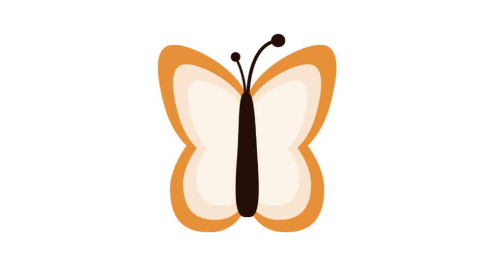
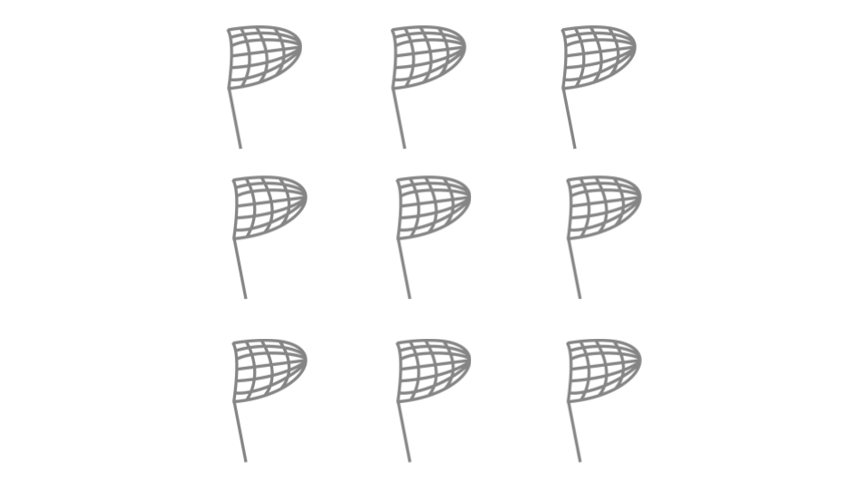
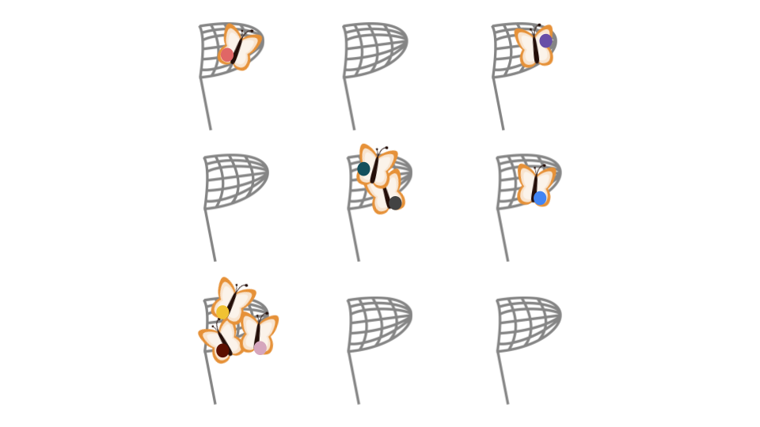
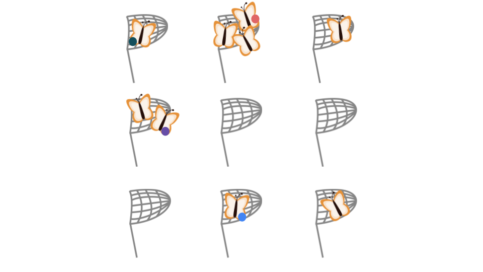
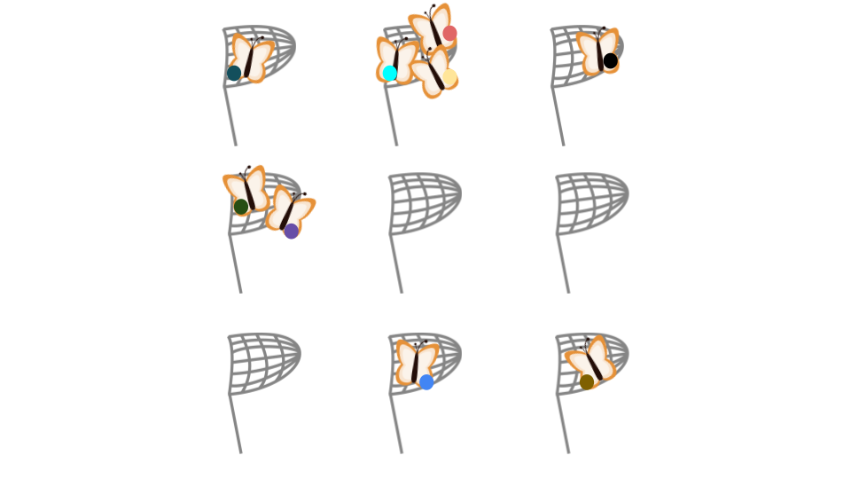
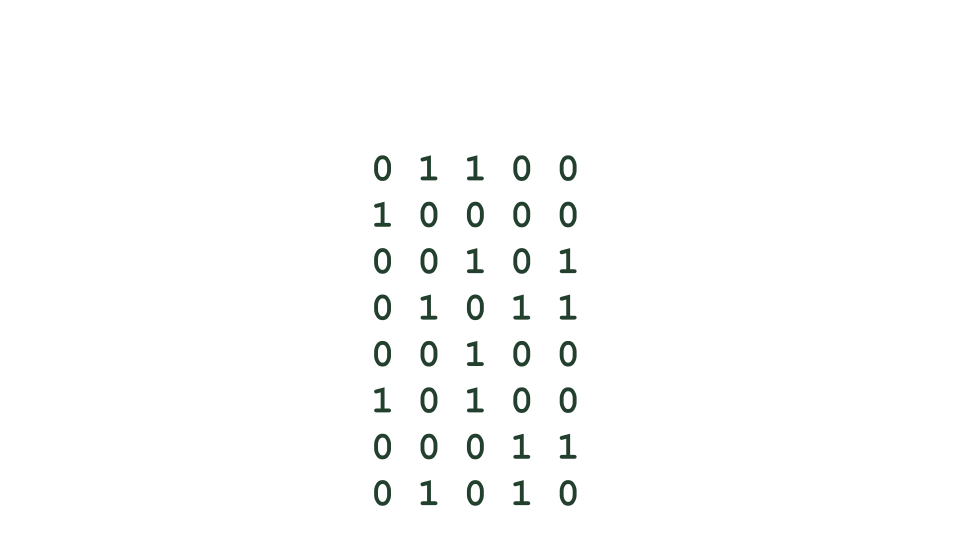
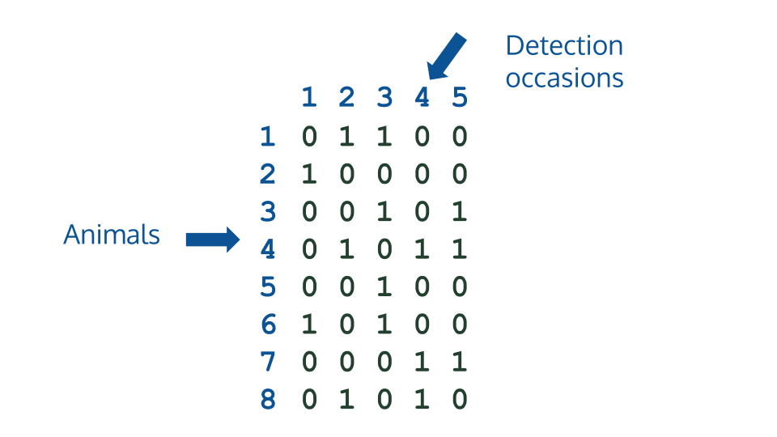
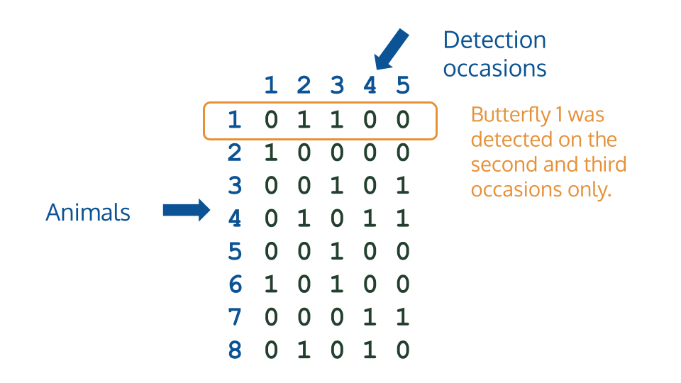
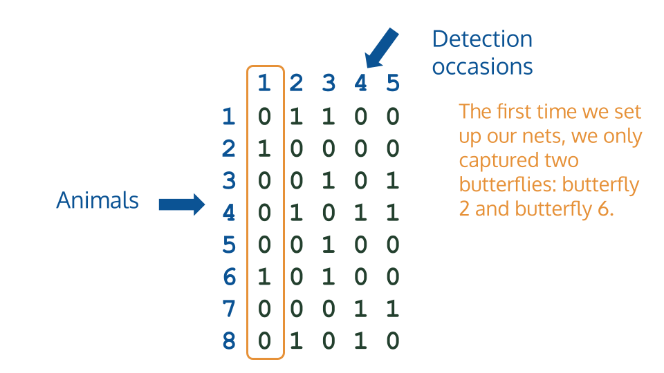

## Some problems with simply counting animals {background-image="img/bg.png" background-opacity="0.7"}

- Animals move
- Tiny animals or camouflaging animals can be very difficult to spot
- Double counting can be hard to avoid when relying on our sight alone 

# Spatially explicit capture-recapture (SECR) {background-image="img/bg.png" background-opacity="0.7"}

## {background-image="img/bg.png" background-opacity="0.7"}


# {background-image="img/bg.png" background-opacity="0.7"}


# {background-image="img/bg.png" background-opacity="0.7"}


# {background-image="img/bg.png" background-opacity="0.7"}


# {background-image="img/bg.png" background-opacity="0.7"}


# {background-image="img/bg.png" background-opacity="0.7"}


# {background-image="img/bg.png" background-opacity="0.7"}


# {background-image="img/bg.png" background-opacity="0.7"}


## Binary capture history {background-image="img/bg.png" background-opacity="0.7"}



## Binary capture history {background-image="img/bg.png" background-opacity="0.7"}



## Binary capture history {background-image="img/bg.png" background-opacity="0.7"}



## Binary capture history {background-image="img/bg.png" background-opacity="0.7"}



## Detection methods {background-image="img/bg.png" background-opacity="0.7"}

- Physical traps
- Microphones
- Cameras
- Hair snares


## Relevant `R` packages {background-image="img/bg.png" background-opacity="0.7" .smaller}

### `secr`

**Authors**: Murray Efford, Philipp Jund, David Fletcher

https://www.otago.ac.nz/density/

https://github.com/MurrayEfford/secr/ 

https://www.stats.otago.ac.nz/secrapp/

### `ascr`

**Author**: Ben Stevenson

https://github.com/b-steve/ascr

### `acre`

**Authors**: Ben Stevenson, Joseph Reps, Lingyu Hao

https://github.com/b-steve/acre

## Example dataset {background-image="img/bg.png" background-opacity="0.7"}

```{r}
#| eval: false
#| echo: true
install.packages(“secr”)
library(secr)

# List available example datasets
data(package = "secr")
```

```{r}
#| eval: true
#| echo: false
library(secr)

# List available example datasets
data(package = "secr")
```

## The Brushtail Possum Trapping Dataset {background-image="img/bg.png" background-opacity="0.7"}

From the `secr` vignette: 

**Description**: Data from a trapping study of brushtail possums at Waitarere, North Island, New Zealand.

**Source**: Landcare Research, New Zealand

## The Brushtail Possum Trapping Dataset {background-image="img/bg.png" background-opacity="0.7"}

The components of the dataset:

- Capture histories (`possumCH`)
- Mask (`possummask`)
- Habitat perimeter (`possumarea`)

## The Mask {background-image="img/bg.png" background-opacity="0.7"}

A mask is a defined habitat region around the detectors/traps, divided into ‘cells’.

https://www.otago.ac.nz/density/pdfs/secr-habitatmasks.pdf

```{r}
#| echo: true
head(possummask)
```

## The Study Area {background-image="img/bg.png" background-opacity="0.7"}

The study area is simply the coordinates of the perimeter of the survey region.

```{r}
#| echo: true
head(possumarea)
```


## Visualize the study area {background-image="img/bg.png" background-opacity="0.7"}
*Code from the `secr` vignette*

```{r}
#| echo: true
plot(possummask)
plot(possumCH, tracks = TRUE, add = TRUE)
plot(traps(possumCH), add = TRUE)
lines(possumarea)
```

## Detection Function {background-image="img/bg.png" background-opacity="0.7"}

A detection function models the probability of detection from the distance of the animal to the detector.

Common detection functions:

- Halfnormal
- Hazard rate
- Exponential
- Uniform

## Halfnormal Detection Function {background-image="img/bg.png" background-opacity="0.7"}

$g(d) = g_0 \exp(-d^2/2\sigma^2)$,

where, 

- $d$ is the distance between the animal and the detector/trap,
- $g_0$ is the probability of trapping/detecting the animal when its distance from the trap is zero,
- $\sigma$ is the scale at which the detection probability decreases as the distance between the animal and the detector/trap decreases

## Halfnormal Detection Function {background-image="img/bg.png" background-opacity="0.7"}

```{r}
#| echo: false
library(ggplot2)
distances <- seq(0, 100, by = 1)
df <- data.frame(distance = distances, sigma = 30, g0 = 1
)
df$prob <- exp(-df$distance^2/(2*30^2)) 
ggplot() +
  geom_line(data = df, aes(x = distance, y = prob)) +
  labs(title = "The Half-Normal Detection Function",
       x = "Distance", y = "Detection Probability") +
  theme_minimal()
```


## Creating a Null Model {background-image="img/bg.png" background-opacity="0.7"}

```{r}
#| echo: true
possum.null <- secr.fit(capthist = possumCH, model = list(D~1, g0~1, sigma~1), mask = possummask, trace = F)
summary(possum.null)
```

## Thank you! {background-image="img/bg.png" background-opacity="0.7"}

Find these slides at: https://melbather.github.io/useR-2026-slides

Find me at: https://statisticsmelissa.netlify.app

## References {background-image="img/bg.png" background-opacity="0.7" .smaller}

1. Borchers, D. and Efford, M. (2008). *Spatially explicit maximum likelihood methods for capture–recapture studies.* Biometrics 64: 377-385.

2. Efford, M. (2025) *secr: Spatially explicit capture–recapture models.* R package version 5.3.0.

3. Stevenson, B., Reps, J., Hao, L. (2026, April 14). *acre*. GitHub. https://github.com/b-steve/acre

4. Stevenson, B. (2025, July 9). *ascr*. GitHub. https://github.com/b-steve/ascr.

5. University of Otago, New Zealand. (2026, May 28). *Software for spatially explicit capture–recapture*. https://www.otago.ac.nz/density/


*Presentation made with Quarto*


